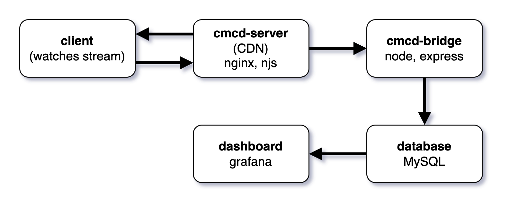
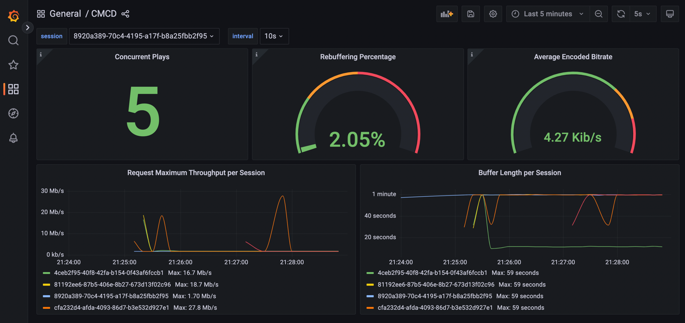

# Streaming Analytics for CMCD

This work expands on the [NUStreaming/CMCD-DASH](https://github.com/NUStreaming/CMCD-DASH) project.

In the repository we provide an end-to-end proof of concept of a video streaming infrastructure which monitors the Quality of Experience (QoE) of the clients watching the stream. The QoE is presented in Grafana dashboard.


## Quick start

You will need `zsh`, [docker](https://docs.docker.com/get-docker/), and [docker-compose](https://docs.docker.com/compose/install/) for this to work.

### 1️⃣ Clone this repo
```
git clone https://github.com/stojkovicv/Streaming-Analytics-CMCD-CMSD
```

### 2️⃣ Source toolbox
In the project root folder run
```bash
source ./toolbox.zsh
```

Alternatively, you can add `toolbox.zsh` into your `PATH` so that you can call the scripts to anywhere and don't have to source toolbox in every new terminal session.

This file contains helpful scripts to start/stop the containers and other control tasks.

### 🐇 Download media files (Big Buck Bunny)
In the root of the project run
```bash
cmcd-pull-media
```

### 🚀 Launch containers
In the root of the project run
```bash
cmcd-up
```

This will spin up the docker-compose configuration in a project called `cmcd`. You can test by running `docker ps`.

You can send GET request `http://localhost:8080/cmcd-njs/testProcessQuery?CMCD=bl%3D21300` to check that the cmcd server is up and running. See `cmcd-server/tests.http` for more examples.

### 🎉 Stream
Open the `stream-client/index.html` file in you browser, the streaming should start automatically.

Even though you are streaming the file from your localhost, you will need to be connected to the internet, so that the [dash.js](https://github.com/Dash-Industry-Forum/dash.js) source code can be downloaded.

### 📊 View dashboard
To open the [CMCD Grafana Dashboard](http://0.0.0.0:3000/d/rivvtDJVz/cmcd). Grafana runs on port 3000, you can access it on http://0.0.0.0:3000.

## Load testing
For this purpose [locust.io](https://locust.io/) is used as a testing framework, simulating several thousands of GET requests to cmcd-server's endpoints.
Testing mechanism is spinned up along with other services, and it's accessbile at http://0.0.0.0:8089. Locust brings up friendy user interface, so that number of users, spawn time and host target can be all tuned directly, or changed at some point. Generated results are available under "Download Data" section in several formats. In order to montitor resource consumption of other services during test run: `docker stats`.

## Components


### CMCD-server

This component serves as the edge server of our CDN. Using a [njs extension](https://nginx.org/en/docs/njs/) and a `proxy_pass`, it parses the CMCD metrics and submits them as JSON object to the CMCD-brdige.

See `nginx/cmcd_njs.js` for the details on how the parameters are parsed and `nginx/config/nginx.cong` for details on the `proxy_pass` configuration.

### CMCD-bridge
Is a container running a simple Node.js server (using the express framework). Its job is to accept a JSON object with the CMCD metrics and persist it into the MySQ database.

### Database
Due to compatibility issues and time pressure we forced to use MySQL as the database technology. MySQL being a relation database management system creates unnecessary overhead for our purposes, however thanks to its compatibility with Grafana it serves well for our Proof of Concept.

### Grafana Dashboard


Connects to MySQL to poll metrics and display them on a dashboard. The configuration of the dashboard is inspired by the [AWS' implementation](https://github.com/aws-samples/cloudfront-cmcd-realtime-dashboard) of a similar system using CloudFront and provides basic monitoring. There are certainly more visualistaions and pannels that could be added.

## Contributors
- **Antonín Vlček** [🐦 @TonyVlcek](https://twitter.com/TonyVlcek), [🐙 TonyVlcek](https://github.com/TonyVlcek)
- **Vuk Stojkovic** [🐙 stepski011](https://github.com/stepski011)
